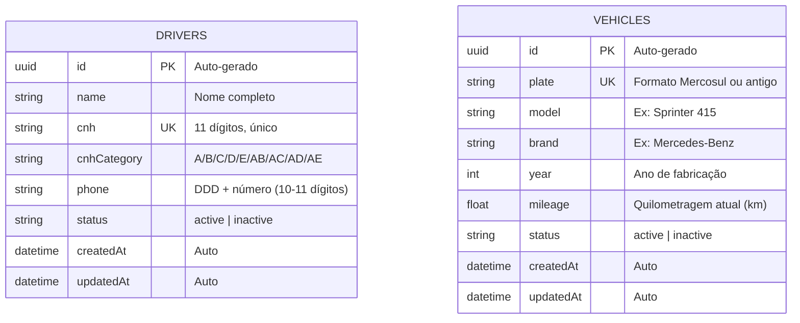
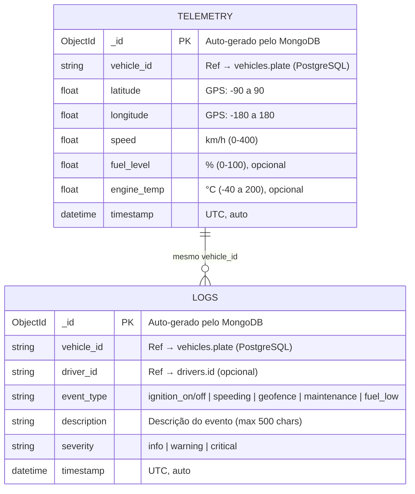
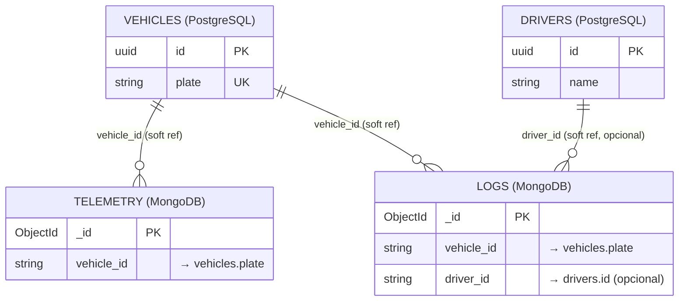
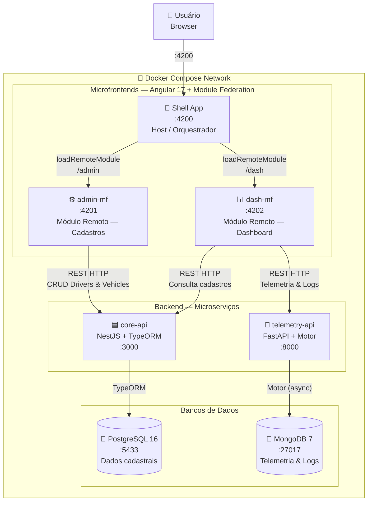
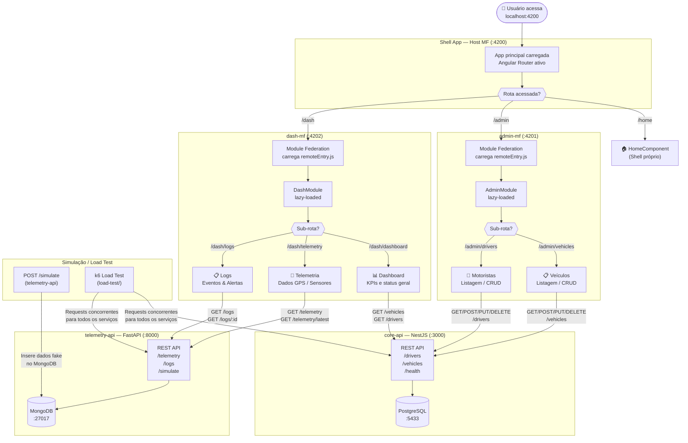

# Fleet Log — Arquitetura e Diagramas

## 1. Diagrama de Relacionamento de Tabelas

O projeto utiliza dois bancos de dados com responsabilidades distintas: **PostgreSQL** para dados cadastrais e **MongoDB** para dados de telemetria e eventos em tempo real.

---

### 1.1 PostgreSQL — `core-api` (Dados Cadastrais)

> Gerenciado pelo NestJS com TypeORM. As tabelas não possuem FK direta entre si; a associação motorista ↔ veículo ocorre via referência de string nas coleções MongoDB.

---

### 1.2 MongoDB — `telemetry-api` (Telemetria e Logs de Eventos)

> Gerenciado pelo FastAPI (Python). Os campos `vehicle_id` e `driver_id` são referências **soft** (string) aos registros do PostgreSQL — não há FK nativa entre bancos.

---

### 1.3 Referências Cross-Database

---

## 2. Diagrama de Componentes da Arquitetura

---

## 3. Fluxograma Geral da Aplicação

---

## Resumo de Portas e Containers

| Container | Imagem / Stack | Porta Host | Porta Interna | Depende de |
|---|---|---|---|---|
| `fleetlog-shell` | Angular 17 (webpack-dev-server) | 4200 | 4200 | admin-mf, dash-mf |
| `fleetlog-admin-mf` | Angular 17 + Module Federation | 4201 | 4201 | — |
| `fleetlog-dash-mf` | Angular 17 + Module Federation | 4202 | 4202 | — |
| `fleetlog-core-api` | NestJS + TypeORM | 3000 | 3000 | postgres (healthy) |
| `fleetlog-telemetry-api` | FastAPI + Motor (async) | 8000 | 8000 | mongodb (healthy) |
| `fleetlog-postgres` | PostgreSQL 16-alpine | 5433 | 5432 | — |
| `fleetlog-mongodb` | MongoDB 7 | 27017 | 27017 | — |
